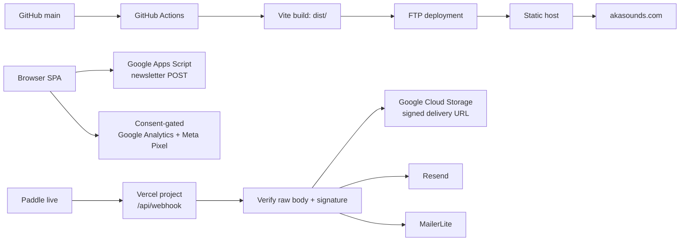
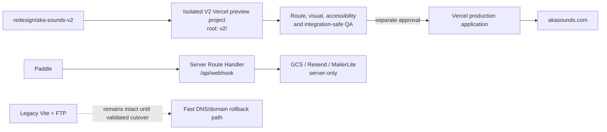

# AKA SOUNDS V2 — G1A: Architecture Blueprint

**Gate:** G1A only — architecture and migration plan.  
**Status:** PASS — no runtime, UI, DNS, Vercel, Paddle, email, or production deployment change was made.

## 1. Baseline verified before analysis

| Check | Result |
|---|---|
| Current branch / upstream | `redesign/aka-sounds-v2` / `origin/redesign/aka-sounds-v2` |
| Initial G1A HEAD | `c37e042f5a938e9fdbac83368c97d831aa142b46` |
| Production `origin/main` | `f98a2a2bf41d13c1698d350ec70755932cddb0ad` |
| Immutable pre-V2 tag | `backup/aka-sounds-production-pre-v2-20260817` → `f98a2a2bf41d13c1698d350ec70755932cddb0ad` |
| Working tree before G1A | Clean (apart from ignored machine-local data) |
| Build | `npm run build` PASS (`tsc` + Vite) |
| CodeGraph | Current: 27 files, 188 nodes, 266 edges; `.codegraph/` remains ignored |

The build regenerated a tracked CSS artifact; it was restored before this document was created. No source or deployment file changed.

## 2. Current architecture — factual map

The repository is a **React + TypeScript + Vite** single-page application, styled with Tailwind and Motion. It uses `HashRouter`; it is not currently a Next.js application despite older README language suggesting otherwise.



### Current responsibilities

| Area | Current implementation | Observation / boundary |
|---|---|---|
| Public frontend | `src/`, Vite, React Router hash routes | Published by GitHub Actions over FTP; `dist/` is tracked. |
| Public domain | `akasounds.com` A records and `www` CNAME to the current CDN host were read-only resolved | DNS was inspected only; no record was changed. |
| Backend | `api/webhook.ts` on a separate Vercel project | This is the live Paddle delivery endpoint, not evidence that the public frontend is served by Vercel. |
| Checkout fulfillment | Paddle event → customer lookup → GCS signed URL → Resend and MailerLite | Server-only responsibilities; credentials must remain outside source. |
| Newsletter | Browser posts to Google Apps Script using `no-cors` | The browser cannot inspect the final service response; this should be replaced behind a server boundary in G2, not in G1A. |
| Measurement | `src/utils/analytics.ts`, invoked after cookie-consent flow | Browser-only and consent-gated; identifiers must remain configuration, not source literals. |
| CI deployment | `.github/workflows/deploy.yml` | Pushes only `main` to FTP and uses a clean-slate deploy. It is not to be altered during G1. |

### Current route inventory

| Current hash route | Current page | Proposed canonical V2 route |
|---|---|---|
| `/#/` | Home / catalog sections | `/` |
| `/#/product/:slug` | Paid product detail | `/sounds/[slug]` |
| `/#/free-trial` | Free trial landing | `/free` (and `/free/[slug]` for each pack) |
| `/#/tutorials` | Tutorials listing | `/tutorials` |
| `/#/deat_aka` | Artist page | `/deat-aka` |
| `/#/legal/:page` | Legal content | `/legal/privacy`, `/legal/terms`, `/legal/refunds` |
| unmatched hash URL | Not found | `not-found.tsx` / standard 404 |

Existing home-section anchors become canonical sections on `/`; campaign URLs should move to normal paths. A fragment is not sent to a server, so a server cannot directly redirect `/#/...`. During coexistence, keep the legacy SPA available; at cutover use a tiny legacy client bridge or campaign-link updates for hash URLs, and HTTP redirects only for path-based legacy URLs.

## 3. Technology decision

### Options assessed

| Option | Fit | Decision |
|---|---|---|
| Keep Vite SPA + separate Vercel webhook | Lowest immediate change, but retains hash routing, split observability and no server-rendered metadata | Not the V2 target |
| Next.js App Router + Vercel, introduced in parallel | File-system routes, server/client separation, metadata, previews and Route Handlers while preserving a rollback path | **Recommended** |
| Full rewrite directly in the repository root | Fewer final folders, but risks replacing the known-good Vite build and current deploy path too early | Reject for the first migration phase |

**Decision:** the intended final topology is a single Next.js App Router application on Vercel (frontend plus server routes), but it must first be developed as an isolated parallel app in `v2/`. The current Vite/FTP website and its production domain remain untouched until preview acceptance and a separately approved cutover.

This uses App Router's file-system routing, Server/Client Component boundary, metadata APIs, and Route Handlers; it is an appropriate fit for a small music catalog with SEO requirements and a server-side commerce boundary. See official [Next.js App Router](https://nextjs.org/docs/app), [Route Handlers](https://nextjs.org/docs/app/getting-started/route-handlers), and [metadata](https://nextjs.org/docs/app/api-reference/functions/generate-metadata) documentation.

## 4. Target V2 route and folder model

No folder below is created in G1A. It is the proposed G1B layout.

```text
v2/
  app/
    (marketing)/page.tsx
    sounds/page.tsx
    sounds/[slug]/page.tsx
    free/page.tsx
    free/[slug]/page.tsx
    tutorials/page.tsx
    tutorials/[slug]/page.tsx
    about/page.tsx
    deat-aka/page.tsx
    deat-aka/lab/page.tsx
    legal/privacy/page.tsx
    legal/terms/page.tsx
    legal/refunds/page.tsx
    api/subscribe/route.ts
    api/webhook/route.ts              # G2 migration only; legacy endpoint remains untouched first
    sitemap.ts
    robots.ts
    layout.tsx
    not-found.tsx
  components/{layout,ui,media}/
  features/{catalog,free,tutorials,artist,audio,commerce,consent,analytics}/
  content/{products,free-packs,tutorials,legal}/
  lib/{catalog,commerce,fulfillment,email,storage,analytics,env,seo}/
  public/
  styles/
  tests/{unit,integration,e2e}/
```

`app/` and server-only `lib/` own request handling and secrets. Interactive audio, checkout launcher, consent banner, visual effects, and the Lab are explicit client components. Public catalog data may be passed from server to client only after removing provider credentials, storage keys, and fulfillment-only fields.

## 5. Commerce and fulfillment model (design only)

G2 should replace scattered conditional mappings with one validated source of truth:

```text
CatalogProduct
  slug, title, type (paid|free), artwork, preview assets, editorial content
Offer
  catalogProductSlug, paddleProductId, paddlePriceId, currency, active, version
FulfillmentPolicy
  offer/version, storageObjectKey, email template key, entitlement description
WebhookReceipt
  paddleEventId (unique), notificationId, occurredAt, processing state, attempts
ConsentRecord
  marketing decision, source, timestamp, policy version
```

Rules for G2:

1. Resolve by an exact configured Paddle **price ID**, then validate its product relationship; never use a premium-pack fallback for an unknown event.
2. Verify the unmodified raw body and signature before parsing. Each notification destination has its own secret; Paddle's SDK verifier is the appropriate boundary. [Paddle signature verification](https://developer.paddle.com/webhooks/about/signature-verification/)
3. Persist `event_id` (and record processing state) in durable storage before side effects. Paddle delivery is at-least-once and can arrive out of order; duplicate emails, URLs, and subscriber writes must be prevented. [Paddle webhook delivery model](https://developer.paddle.com/webhooks/about/how-webhooks-work/)
4. Keep storage object keys, email sending, and MailerLite writes server-only. Signed URLs are generated only after an accepted fulfillment decision.
5. A marketing subscription is independent from purchase fulfillment. Only an explicit, recorded consent decision may drive marketing status.
6. Return success only after the event is durably accepted; process safe retries deliberately. No change to this behavior is made in G1A.

The durable receipt store is required for idempotency, but its provider is a G2 implementation decision. It must be a small managed persistent database, not function memory or a browser store.

## 6. Content, assets, audio, and Lab

### Content model

For the current small catalog, use typed local content as the initial source of truth, validated at build time. Use MDX only for long-form tutorials and artist/editorial pages where authoring markup adds value. Do not introduce a CMS until non-developers need independent publishing, scheduled releases, workflow approvals, or frequent asset revisions. This keeps V2 inexpensive and reviewable.

### Asset policy

| Store in Git | Keep out of Git / serve externally |
|---|---|
| Source code, small optimized brand assets, thumbnails/posters, legal and editorial content, typed metadata, waveform summaries | `node_modules`, `dist`, temporary browser profiles, `.codegraph`, source masters, downloadable pack archives, large audio/video originals, credentials |

Product-download archives remain in protected object storage. Audio previews should be encoded for web playback, range-request capable, lazy-loaded, and represented by a small waveform/track manifest. Video loops need a poster and must be deferred until useful; replace or remove decorative media that harms LCP. `next/image` should handle eligible imagery with explicit dimensions.

### Audio architecture

Create one client-side `AudioProvider` owning a single `HTMLAudioElement`: play/pause, current track, seeking, volume, Media Session metadata, lifecycle cleanup, and accessible keyboard controls. Product cards request a track; they do not instantiate competing players. Preload metadata only, defer waveform and audio source fetches until intent, and provide a clear fallback if audio is unavailable.

### DEAT_AKA Lab

`/deat-aka/lab` is an explicitly isolated experimental route. Its graphics code, shader/worker dependencies, and media belong below `features/lab/`; load the route dynamically with a bounded fallback and feature detection. React supports deferring component code with `lazy`; use a visible non-blocking fallback. [React `lazy`](https://react.dev/reference/react/lazy) and [Suspense](https://react.dev/reference/react/Suspense). The Lab cannot enter the global marketing bundle or block the main artist route.

## 7. SEO, analytics, and consent boundaries

The target must use normal URLs, SSR/static rendering where content permits, a root `metadataBase`, per-product `generateMetadata`, canonical URLs, Open Graph images, JSON-LD for products/organization where accurate, `sitemap.ts`, and `robots.ts`. This removes HashRouter's crawler and sharing limitations without claiming an immediate ranking outcome.

Analytics remains client-side and consent-gated. Establish a small event interface (`catalog_view`, `preview_started`, `checkout_opened`, `newsletter_submitted`, `fulfillment_completed`); providers are adapters, never imported throughout feature code. Essential technical cookies are separate from optional measurement/marketing consent. The newsletter's eventual `/api/subscribe` must validate input, report truthful service outcomes, and retain no secret in the client.

## 8. Deployment topology and safe migration

### Recommended end state



The final target is **Option B: frontend and backend on Vercel**, not because deployment itself is a G1 activity, but because one routing, preview, observability, and secret boundary is materially simpler than split hosting. Option A (FTP frontend plus Vercel backend) remains the rollback topology during migration. No DNS, project, environment, domain, or deployment modification is authorized in G1A.

In G1B, create a separate V2 preview project rooted at `v2/`; do not repoint the existing production Vercel project. Preview deployments must use preview/sandbox service credentials and isolated recipients/buckets/lists where applicable—never production fulfillment credentials by default. Vercel environments distinguish Local, Preview, and Production; preview deployments are intended for branch testing without changing the production domain. [Vercel environments](https://vercel.com/docs/deployments/environments) and [environment variables](https://vercel.com/docs/environment-variables).

### Cutover and rollback gates (future approval required)

1. Confirm every canonical V2 route, metadata, checkout launch, audio control, webhook behavior, consent state, and error path in a preview.
2. Approve a production domain/DNS plan separately; reduce TTL only if the DNS owner approves.
3. Attach the domain to the approved Vercel production project and validate HTTPS, `www` behavior, canonical URLs, and webhook destination independently.
4. Keep the FTP deployment and immutable pre-V2 tag available until post-cutover checks pass.
5. If critical validation fails, restore the prior domain/DNS target and use the preserved FTP site; investigate before retrying. Do not use a forced Git rewrite or change `main` to roll back.

## 9. Incremental migration sequence

| Phase | Scope | Must remain untouched |
|---|---|---|
| G1B | Scaffold `v2/`, TypeScript/Next/Tailwind baseline, route contracts, shared design primitives, local-only/preview checks | Existing `src/`, `api/webhook.ts`, FTP workflow, production Vercel settings, DNS |
| G1C | Port public content/routes in parallel; establish canonical metadata, accessibility and visual acceptance | Legacy production hosting and production domain |
| G2 | Implement the commerce model, verified webhook migration, idempotency, truthful newsletter endpoint, consent-aware marketing boundary | No live credential disclosure; no production change without a dedicated gate |
| G3 | Preview E2E, performance, analytics-consent and rollback rehearsal | `main` and production remain unchanged until sign-off |
| Cutover gate | Human-approved domain/Vercel production switch | Preserve backup tag and legacy recovery path |

Delete neither the Vite application nor the tracked legacy deployment artifacts until the replacement has accepted route parity, integrations, preview tests, cutover verification, and rollback validation. Removing them is outside G1A.

## 10. Test architecture for V2

- **Static checks:** TypeScript, lint, production build, and schema validation for catalog/offer mappings.
- **Unit tests:** price-to-offer resolution, unknown-price rejection, marketing-consent decisions, legacy URL mapping, metadata construction, and audio state reducer.
- **Route/browser tests:** route smoke matrix, 404, keyboard audio controls, consent behavior, canonical metadata, responsive product pages, and Lab fallback.
- **Webhook integration tests:** synthetic signed fixtures, duplicate event receipt, out-of-order events, retry behavior, and mocked GCS/Resend/MailerLite adapters. Use Paddle sandbox/simulator only in explicitly non-production environments; never execute a live purchase as a preview test.
- **Release checks:** Vercel preview build/log inspection, no client-secret scan, link/sitemap checks, accessibility and performance budgets, then a documented rollback decision.

## 11. Expected G1B change boundary

**Expected to be added:** `v2/**`, its isolated build/test configuration, and documentation/tests needed by the scaffold.

**Must not be changed in G1B without a new explicit gate:** `api/webhook.ts`, the current `src/**` Vite runtime, `public/**`, `dist/**`, `.github/workflows/deploy.yml`, Paddle notification settings, Vercel Production variables/settings, MailerLite/Resend configuration, DNS, and the production domain.

## 12. Risks and mitigations

| Risk | Mitigation |
|---|---|
| A root-level rewrite breaks the known FTP build | Isolate V2 in `v2/` first; retain the legacy application. |
| Split frontend/backend creates inconsistent URLs or analytics | Declare the final unified target, but maintain explicit API and environment boundaries during coexistence. |
| Hash URLs lose inbound traffic | Inventory campaign links, retain legacy SPA, and use a client bridge for fragments at approved cutover. |
| Duplicate Paddle delivery causes duplicate fulfillment | Durable `event_id` receipt and idempotent side-effect workflow in G2. |
| Preview accidentally reaches production services | Separate Vercel environment values and sandbox/mock adapters; no production secrets by default. |
| Large media degrades landing performance | Poster-first, lazy media, web encodes, route isolation, performance budgets. |

## 13. G1A conclusion

**G1A STATUS: PASS**

The approved architectural direction is an isolated `v2/` Next.js App Router migration, previewed separately and cut over only through a future human-approved gate. G1B may begin only after human review of this document. G2, UI redesign, Next.js installation, deployment, DNS, Vercel production changes, and any commerce-side modification were **not** started by G1A.
